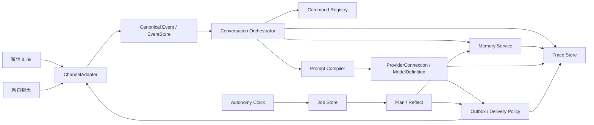

# WeBot 开源框架对照研究

> 核验日期：2026-07-22
> 用途：为 WeBot 后续设计和代码评审提供长期对照，不代表要引入或整体迁移到这些框架。

## 已落地的第一版

2026-07-22 已先实现 P0 中的 Prompt 可解释性基础：

- `PromptCompiler` 将平台规则、角色身份、世界书、长期记忆、自主经历、
  示例、历史和当前输入编译为统一 `PromptPlan`；
- 每个区块记录来源、信任级别、优先级、估算 token、采用/裁剪/省略状态和
  原因；
- OpenAI Responses 与 Chat Completions 共用同一个 Plan，再分别渲染请求；
- 默认输入预算为 24,000 估算 token，始终优先保留当前输入、核心身份、
  最近一轮和平台表现规则；
- 每个 Agent 私密保留最近 20 条 Prompt Trace，可在后台按需查看最终请求、
  Provider 用量、耗时和失败信息；清空记忆时 Trace 同步删除。

这只是第一版，不等于 P0 已全部完成。`EventStore`、统一 `traceId`、Adapter
投递回执和持久 `JobStore + Outbox` 仍在后续路线中。

## 结论先行

WeBot 当前最有价值的特点是轻量、TypeScript 主链路清晰、微信 iLink 通道独立，
并且已经拥有角色隔离、角色卡、长期记忆、自主经历、Provider 和管理后台。
没有任何一个现成框架值得整体替换它。

更合适的做法是“按能力选择参考系，独立实现”：

| 能力 | 首要参考 | WeBot 应学习什么 |
|---|---|---|
| 角色扮演体验 | [SillyTavern](https://github.com/SillyTavern/SillyTavern)、[RisuAI](https://github.com/kwaroran/Risuai) | 可审计提示词编排、世界书、角色卡兼容、分支聊天 |
| 多用户角色聊天 | [Agnai](https://github.com/agnaistic/agnai) | 消息 DAG、多用户多角色、网页聊天数据模型 |
| 核心与档案记忆 | [Letta](https://github.com/letta-ai/letta) | 有界核心记忆、可检索档案、后台整理 |
| 事实抽取与召回 | [Mem0](https://github.com/mem0ai/mem0) | 事实抽取、作用域、去重、混合检索 |
| 时间与关系变化 | [Graphiti](https://github.com/getzep/graphiti) | 来源追溯、事实有效期、矛盾事实失效而非覆盖 |
| 自主生活 | [Generative Agents](https://github.com/joonspk-research/generative_agents)、[AI Town](https://github.com/a16z-infra/ai-town) | 观察、计划、反思、行动的分离和阈值触发 |
| 通道与插件内核 | [Koishi](https://github.com/koishijs/koishi)、[NoneBot2](https://github.com/nonebot/nonebot2) | 统一事件、Adapter 能力、服务依赖、生命周期和 Matcher |
| 一体化 Bot 产品 | [AstrBot](https://github.com/AstrBotDevs/AstrBot) | WebUI、Provider、聊天、Trace 和插件页的产品整合 |
| Provider 与运行日志 | [Dify](https://github.com/langgenius/dify)、[Langfuse](https://github.com/langfuse/langfuse) | Provider schema、凭证校验、调用链、Prompt 版本和评测 |
| 管理体验与权限 | [Open WebUI](https://github.com/open-webui/open-webui) | Model Preset、资源权限、浏览器聊天和任务历史 |

原则上，WeBot 应保留当前 TypeScript 内核，先把事件、提示词、记忆、调度、
发送和观测的边界做清楚，再根据真实数据量选择 SQLite、向量检索或图数据库。

## 当前基线与主要缺口

当前代码已经形成以下边界：

- `WeixinAdapter`：iLink 收发、Typing、语音和上下文 token；
- `AgentFramework`：命令、Agent 选择、模型调用和记忆编排；
- `AgentStore`：角色档案、原始聊天、摘要、事实和经历；
- `AutonomyScheduler`：离线经历生成和受限主动联系；
- `ProviderRegistry`：OpenAI、DeepSeek 和兼容 API；
- `AdminServer`：本地管理 Agent、Provider 和 API Key。

继续扩展前需要解决的结构性问题：

1. Prompt 已有统一编译、预算和 Trace，但还缺版本管理、对照评测与跨调用 traceId；
2. 长期事实和经历会整体注入，数据增长后缺少相关性检索、证据链和时间有效性；
3. 自主经历、调度任务和实际投递尚未形成可重放的任务账本和 outbox；
4. iLink token 属于传输状态，但当前还没有统一的 token 新鲜度与 Adapter 能力模型；
5. 微信、未来网页端以及其他通道尚未共享一个正式的 `CanonicalEvent` 接口；
6. 管理后台已经能检查 Prompt 和单次模型调用，但还缺分支聊天、完整调用链与
   记忆证据来源。

## 一、角色扮演框架

### SillyTavern：提示词和世界书的功能上限

官方的 [Prompt Manager](https://docs.sillytavern.app/usage/prompts/prompt-manager/)
可以编排角色、人格、场景、示例、历史和 Post-History Instructions；
[World Info](https://docs.sillytavern.app/usage/core-concepts/worldinfo/) 支持
关键词、递归、优先级、token 预算、插入位置和向量匹配。聊天层还具有 swipe、
checkpoint、branch、chat tree 和群聊。

值得借鉴：

- Prompt 应是有类型、有顺序、有预算的计划，而不是不可解释的字符串；
- 世界书每次命中都应记录触发原因、来源和插入位置；
- regenerate、swipe 和 branch 应落到消息数据模型，而不是复制整份聊天；
- 摘要和向量召回都必须允许用户查看、修改或禁用。

不应照搬：

- 大量高级开关会让普通用户难以理解；
- 任意第三方扩展会带来服务器端代码执行和供应链风险；
- 自动摘要本身可能遗漏或虚构，不能被当作事实源。

许可证是 AGPL-3.0。可以借鉴公开设计，但不应直接复制代码、组件或样式到
MIT 许可证的 WeBot，除非明确接受相应许可证义务。

### RisuAI：角色卡兼容和分层角色记忆

RisuAI 支持 Character Card V2/V3、PNG、JSON、CharX 和资产保留；提示词使用
可排序的 typed items，Lorebook 具有扫描深度、预算、递归、正则、选择键和
插入深度。其 HypaMemory 将摘要块和语义召回结合，SupaMemory 进行递进压缩。

值得借鉴：

- 内部角色模型与外部角色卡格式分离；
- 导入后保留未知 `extensions` 和资产，以便无损 round-trip；
- 最近原文、滚动摘要、结构化事件和语义往事是不同层；
- 记忆占用应有明确 token 比例，不能无限挤占最近对话。

角色卡中的 `system_prompt`、宏和脚本必须视为不可信输入。它们不得覆盖平台
规则、用户权限或工具安全边界。RisuAI 为 GPL-3.0，同样只作设计参考。

可将 MIT 的 [Character Card V3 规范](https://github.com/kwaroran/character-card-spec-v3)
作为兼容依据。`@risuai/ccardlib` 可用于交叉测试，但在维护活跃度、完整
round-trip 和安全审计验证前，不必替换 WeBot 当前解析器。

### Agnai：消息 DAG 和网页聊天

Agnai 的消息原生保存父节点，支持 fork、rejoin 和图形化分支；这比“复制整个
会话文件”更适合未来的电脑网页端。建议为每条消息增加：

```text
message_id
parent_message_id
branch_id
speaker_id
created_at
selected_variant_id
```

微信端仍显示当前分支的线性投影，网页端则可以 regenerate、swipe、fork 和
回到父节点。Agnai 为 AGPL-3.0，只参考模型，不复制实现。

## 二、记忆框架

### Letta：核心块、档案和后台整理

Letta 的 [Memory Blocks](https://docs.letta.com/guides/core-concepts/memory/memory-blocks)
是始终在上下文中的有界结构；较大的信息进入可检索档案。官方
[Context Hierarchy](https://docs.letta.com/guides/core-concepts/memory/context-hierarchy)
进一步区分常驻块、文件、档案记忆和外部 RAG。

WeBot 可以独立实现以下块，而不引入完整 Letta 运行时：

```text
persona       角色核心身份，只读、版本化
human         用户稳定信息，可审计
relationship  当前关系状态和边界
world         当前世界状态
goals         仍未完成的目标与承诺
state         角色当前心境和短期计划
```

常驻块必须有字符/token 上限。普通往事不应一直常驻，而应按需检索。

### Mem0：抽取、去重与作用域检索

Mem0 的 [Add Memory](https://docs.mem0.ai/core-concepts/memory-operations/add)
流程包含信息抽取、冲突处理和存储；[Search](https://docs.mem0.ai/core-concepts/memory-operations/search)
强调 `user_id`、`agent_id` 和 `run_id` 作用域、向量召回、过滤与 rerank。

适合 WeBot 的不是直接替换存储，而是让记忆成为可插拔服务：

```ts
interface MemoryService {
  ingest(events: DomainEvent[]): Promise<MemoryCandidate[]>;
  retrieve(query: MemoryQuery): Promise<MemoryEvidence[]>;
  accept(candidateId: string): Promise<void>;
  reject(candidateId: string): Promise<void>;
  invalidate(memoryId: string, reason: string): Promise<void>;
}
```

Mem0 OSS 与托管平台的能力并不完全相同。未来若做适配器，应使用固定评测集
与自研实现 A/B，不应让业务层绑定其某一版本返回结构。

### Graphiti：证据链和双时间，而不是立即上图数据库

Graphiti 以 episode 保存原始来源，并将事实表示为带时间的关系。其核心价值是
区分“系统何时知道”和“事实何时成立”，矛盾事实会失效而不是被直接删除。
[官方概览](https://help.getzep.com/graphiti/getting-started/welcome) 和
[Adding Episodes](https://help.getzep.com/graphiti/core-concepts/adding-episodes)
说明了增量 episode 与来源关系。

当前 WeBot 先在 JSON/SQLite 中加入这些字段即可：

```ts
interface MemoryRecord {
  id: string;
  userId: string;
  agentId: string;
  kind: "profile" | "preference" | "episode" | "task" | "relationship";
  text: string;
  status: "candidate" | "accepted" | "rejected" | "invalidated";
  confidence: number;
  importance: number;
  observedAt: string;
  validFrom?: string;
  validTo?: string;
  sourceEventIds: string[];
  extractorVersion: string;
}
```

只有真实查询开始大量涉及多跳关系、历史状态或“截至某日”的推理，并且评测
证明图检索优于关系数据库后，才考虑 Graphiti、Neo4j 或其他图存储。

## 三、自主 Agent 与持久任务

### Generative Agents：观察、计划、反思、行动

[Generative Agents 论文](https://arxiv.org/abs/2304.03442) 的关键不在模拟小镇，
而在完整经历流、高层反思和动态检索。论文消融表明 observation、planning 和
reflection 都影响行为可信度。

WeBot 当前“每隔一段时间直接生成经历”应逐步演进为：

```text
Observe  读取时间、计划、世界状态和近期事件
Retrieve 按相关性 + 重要性 + 近期性选取证据
Plan     形成短期目标，不直接修改事实
Reflect  累计重要度达到阈值时形成高层认识，并绑定证据
Act      产生自主经历；是否联系用户由独立策略决定
```

反思不能直接升级为用户事实，必须带来源事件、置信度和可撤销状态。

### AI Town：持续世界和成本边界

[AI Town](https://github.com/a16z-infra/ai-town) 是 MIT 的 TypeScript 自主角色
参考，包含共享状态、事务、模拟引擎、向量检索和后台 cron。最值得借鉴的是：

- 世界状态与聊天消息分开；
- 角色行动由模拟时钟推进；
- 后端可暂停、恢复、归档和回放；
- 自主活动必须有明确停止条件，避免无人使用时持续消耗模型费用。

WeBot 不需要地图或游戏引擎，只需要 `WorldState + Plan + Event + Clock` 四个
轻量概念。

### LangGraph：checkpoint 和幂等任务边界

LangGraph 的价值是持久 checkpoint、恢复、重放和 human-in-the-loop，而不是
它所绑定的具体 Agent API。WeBot 可以借鉴运行语义，但不必迁移到 Python 或
LangChain。

自主任务应独立持久化：

```ts
interface ScheduledJob {
  id: string;
  idempotencyKey: string;
  userId: string;
  agentId: string;
  nextRunAt: string;
  timezone: string;
  state: "pending" | "leased" | "completed" | "failed" | "cancelled";
  leaseUntil?: string;
  attempts: number;
  maxAttempts: number;
  maxCost?: number;
  createdFromEventId?: string;
  lastError?: string;
}
```

生成自主经历、建议联系用户、实际投递是三个不同状态，不能用一个布尔值代替。

## 四、Bot 平台、Provider 与后台

### Koishi：最适合作为 WeBot 架构对照

Koishi 将 Bot 发送和 Adapter 接收分开，并把数据库、控制台、资源等能力建模
为可替换 Service。插件显式声明必需/可选依赖，服务重载时有生命周期和资源
清理。[开发指南](https://koishi.chat/en-US/guide/) 和
[服务与依赖](https://koishi.chat/zh-CN/guide/plugin/service) 是 WeBot 后续拆分
内核最值得持续参考的资料。

建议形成：

```ts
interface ChannelAdapter {
  capabilities: ChannelCapabilities;
  start(emit: (event: CanonicalEvent) => Promise<void>): Promise<void>;
  stop(): Promise<void>;
  send(message: OutboundMessage): Promise<DeliveryReceipt>;
  health(): Promise<ChannelHealth>;
}
```

能力必须显式声明，例如：

```text
supportsProactiveDelivery
supportsReply
supportsEdit
supportsMedia
supportsTyping
requiresFreshContextToken
```

### NoneBot2：Matcher 和依赖注入

NoneBot2 适合参考事件处理内核：规则、权限、状态、优先级、阻断、临时 Matcher
和类型化依赖注入。WeBot 的 `/agent`、`/memory`、`/life` 不应长期堆在一个
`switch` 中，而应逐步变成可注册、可测试的命令处理器和中间件链。

### AstrBot：最接近目标产品形态

[AstrBot WebUI](https://docs.astrbot.app/en/use/webui.html) 已整合 Provider、插件、
日志、统计、浏览器聊天、Trace 和 TOTP；插件页通过受限 iframe 与后台桥接。
这很适合作为 WeBot 管理体验的上限参考。

应借鉴：

- 浏览器聊天与微信共用同一个 Agent 和记忆；
- 每条消息展示模型、耗时、token、工具和检索来源；
- 简单配置使用 schema 表单，复杂扩展才使用独立页面；
- 后台账号采用随机初始密码、修改密码和可选 TOTP。

不应直接开放第三方插件市场。AstrBot 也明确提示无法保证市场插件安全；
WeBot 初期只应加载管理员审核的本地插件。AstrBot 为 AGPL-3.0。

### Dify、Open WebUI 与 Langfuse：只参考管理和观测

Dify 最值得参考的是 Provider schema：连接、模型和角色应拆成三层：

```text
ProviderConnection  协议、端点、密钥、健康状态
ModelDefinition     能力、上下文窗口、成本、流式、工具调用
AgentProfile        人格、记忆、工具、模型路由和 fallback
```

Open WebUI 的 Workspace Model/Model Preset 同样证明了“底层模型连接”和“用户
看到的 Agent 入口”不应混为一体。Dify 部署很重，Open WebUI 不是多通道 Bot
框架，两者都不应嵌入 WeBot。

[Langfuse Trace 数据模型](https://langfuse.com/docs/observability/data-model) 将一次
请求表示为 trace，并在其中嵌套 generation、retrieval 和 tool-call observation；
[Prompt Management](https://langfuse.com/docs/prompt-management/overview) 则把 Prompt
版本和调用指标关联起来。WeBot 可先实现兼容 OpenTelemetry 的本地 trace schema，
未来再选择是否接入 Langfuse。

## 五、WeBot 目标架构



所有平台 token 都只属于 `ChannelAdapter` 的传输状态：

```ts
interface TransportToken {
  platform: string;
  accountId: string;
  channelId: string;
  token: string;
  issuedAt?: string;
  lastSeenAt: string;
  expiresAt?: string;
  sourceMessageId: string;
}
```

它们不得进入角色记忆。每次用户消息应立即更新；每次主动发送前仍要校验
新鲜度、平台、账号和会话映射。

## 六、推荐路线图

### P0：正确性和可解释性

1. 建立 append-only `EventStore` 和统一 `traceId`；
2. 为 Adapter 增加能力声明、token 新鲜度和结构化 `DeliveryReceipt`；
3. 把提示词构建改为可审计 `PromptPlan`，记录来源、优先级、token 和裁剪；
4. 将自主任务改为持久 `JobStore + Outbox`，加入幂等键、租约、重试和死信；
5. 后台严格区分“已生成、已交给 Adapter、平台接受、用户可见”。

### P1：角色和记忆质量

1. 角色卡导入导出保留未知扩展和资产；
2. 建立 persona/human/relationship/world/goals/state 记忆块；
3. 所有事实和反思增加来源、置信度、有效时间和 extractor 版本；
4. 使用“最近消息 + 有界核心块 + Top-K 证据记忆”构建上下文；
5. 增加受控 WorldBook：作用域、关键词/正则、优先级、预算、有效期和命中日志。

### P2：电脑网页端和可信自主性

1. 使用消息 DAG 支持 regenerate、swipe 和 branch；
2. 网页端与微信共用 Agent、记忆和当前分支；
3. 自主引擎拆成 observe/retrieve/plan/reflect/act；
4. 累计重要度或会话结束才触发反思，反思必须绑定证据；
5. 加入 Prompt 查看、记忆纠正、任务历史、费用和延迟视图。

### P3：规模化后再引入的能力

1. 单机从 JSON 迁移 SQLite，保留 JSON 导入导出；
2. 多实例再迁 PostgreSQL，并按评测需要增加 pgvector；
3. 真实查询集证明需要多跳和历史关系后才试验 Graphiti；
4. 插件先做 Manifest、权限和生命周期，再考虑市场或沙箱；
5. 复杂多步骤 Agent 任务确有需要时，再评估 LangGraph 或外部 Dify 工作流。

## 七、后续功能的验收基线

任何实现都不应只以“能运行”作为完成标准：

- 角色卡：V2/V3/CharX round-trip 后未知扩展与资产不丢失；
- Prompt：每次调用都能解释哪些片段被加入、裁剪或拒绝；
- 记忆：能处理“以前住上海，现在住杭州”，且两条事实都有来源和有效期；
- 隔离：不同用户、Agent、平台和账号不会串记忆或 token；
- 删除：原始事件、派生摘要、embedding、图节点和备份索引可完整删除；
- 自主任务：重复执行不会重复生成或发送，崩溃后可以恢复；
- 投递：过期 token、错误账号、免打扰时段和每日上限会安全拒绝；
- 分支：网页切换分支不会改变微信当前分支，除非用户明确选择；
- 观测：一次消息可追踪 Adapter、权限、记忆、Prompt、模型和发送全过程；
- 成本：后台任务有调用预算，空闲时不会无限消耗模型费用。

## 八、许可证边界

WeBot 当前是 MIT。参考项目的许可证差异必须在复用前重新核验：

| 项目 | 当前许可证 | 使用边界 |
|---|---|---|
| SillyTavern、Agnai、AstrBot | AGPL-3.0 | 只参考公开设计；直接组合代码用于网络服务通常会带来源码提供义务 |
| RisuAI | GPL-3.0 | 不复制其代码、默认 Prompt、素材或组件到 WeBot |
| Letta、Mem0、Graphiti、Generative Agents | Apache-2.0 | 可评估库或移植，但需保留声明并检查依赖许可证 |
| AI Town、Koishi、NoneBot2、LangGraph | MIT | 兼容性较好，复用时仍需保留版权和许可证声明 |
| Dify | 修改版 Apache-2.0 | 多租户商业服务和前端标识有附加条件 |
| Open WebUI | 自定义许可证 | 新版本含品牌和用户规模条件，不作为可直接复用前端 |
| Langfuse | 核心 MIT，部分 EE 目录另行许可 | 只使用明确属于 MIT 的 SDK/组件，部署前核验具体目录 |

这不是法律意见。任何实际复制、组合、分发或对外托管前，都应再次检查目标
commit 的 `LICENSE`、依赖和素材授权。角色卡及其头像、语音也可能拥有独立版权。

## 九、维护方式

每次进行较大的 WeBot 更新前，按以下顺序复查本文件：

1. 明确本次更新属于角色、记忆、自主性、通道、Provider、UI 还是观测；
2. 只检查相应的 2–3 个首要参考项目，不盲目追随所有新功能；
3. 阅读最新 Release、迁移指南、安全公告和许可证；
4. 把参考设计转写成 WeBot 自己的接口与验收条件；
5. 用人工构造、不含真实聊天的评测集验证一致性、记忆准确率、成本和延迟；
6. 记录“采用、试验、拒绝”的理由，避免几个月后重复讨论。

建议每季度更新一次维护快照；GitHub stars 只作为社区活跃信号，不作为技术
质量结论。2026-07-22 核验时，上述主项目除研究原型外均有近期维护活动。
